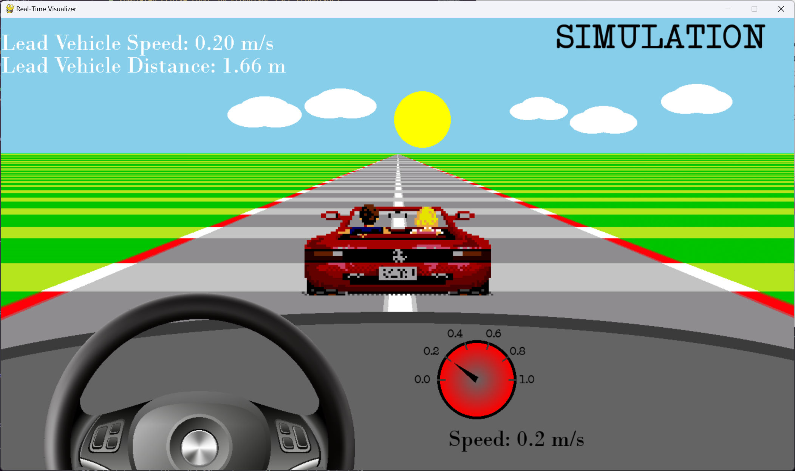

# Simulated Cruise Loop, by PropulsorTech (SCL Propulsor)

Developer Names: Alexander Antohe, Daniel Lupas, Nicholas Petrunti, Pesara Amarasekera, Samuel Khzym

Date of project start: September 3rd, 2024

The project aims to develop a comprehensive testing environment for an adaptive cruise control (ACC) algorithm that integrates a Software-in-the-Loop (SIL) environment, a Hardware-in-the-Loop (HIL) environment, and a real-time visualizer, using an RC (radio-controlled) vehicle as the platform.

## Project Overview

### Test Environments

#### Software-in-Loop (SIL) Environment

The SIL environment compiles the ACC algorithm for a PC target (as opposed to the normal board target), and runs the environmental simulator, ACC algorithm, plant model, and visualizer in a closed-loop simulation. The module breakdown and data flow diagram is below.

#### Hardware-in-Loop (HIL) Environment

The HIL environment compiles the ACC algorithm and the safety monitor software for the microcontroller, the RC vehicle code for the Arduino, and runs the environmental simulator and visualizer in a closed-loop simulation. The RC vehicle is placed on the dyno platform. The simulator and the microcontroller communicate over Ethernet, and the microcontroller and Arduino communicate over UART. The module breakdown and data flow diagram is below.

### Subsystems

### Adaptive Cruise Control (ACC) Algorithm

The ACC algorithm takes in a lead vehicle speed ($V_L$), a lead vehicle distance ($D_L$), an ego (host) vehicle speed ($V_E$), and a driver-provided set speed ($V_S$). It will then determine an actuation request in the form of a PWM value between 0-255 to control the RC car's motors. This is written in C and is to be deployed onto the [STM32H735G Discovery Board](https://www.st.com/en/evaluation-tools/stm32h735g-dk.html).

Image Credits: Moradi, Mehrdad & Oakes, Bentley & Saraoğlu, Mustafa & Morozov, Andrey & Janschek, Klaus & Denil, Joachim. (2020). Exploring Fault Parameter Space Using Reinforcement Learning-based Fault Injection. 102-109. 10.1109/DSN-W50199.2020.00028. 

### Safety Monitor

To ensure the proper transmission and retreival of signals between hardware components, a safety monitor is present to perform two signal integrity checks - a CRC checksum for confirmation of correct data transmission, and a rolling counter for the confirmation of proper message sequencing. If enough errors are detected over a certain threshold, the monitor will cease operation of the system.

### Environmental Simulator + Visualizer

The environmental simulator allows the user to load a lead vehicle drive cycle and keeps track of the ego vehicle's position over time with respect to the lead vehicle. The lead vehicle drive cycle can be loaded in as a csv file of lead vehicle speed to time breakpoints, which are linearly interpolated to fill in the rest of the drive cycle.

The lead vehicle's relative distance, ego speed, and lead speed, are all visualized in a simple visualizer component which displays the lead vehicle which scales as it gets closer, and a set of dashed lane lines which move along with the ego vehicle.

### Ego Vehicle Plant Model

The RC vehicle dynamics are modeled as a 2nd-order ideal transfer function parameterized by $K$, $\zeta$, and $\omega_n$. The input is a PWM command (between 0 and 255), and the output is the vehicle speed. This transfer function is converted to state space equations and stepped in discrete time using the Forward Euler method. These values were empirically derived by taking a swept sine input of the RC vehicle and analyzing the subsequent Bode plot to match the measured frequency response to a modeled response.

$\frac{V_E(s)}{\text{PWM}(s)} = \frac{K\omega_n^2}{s^2 + 2 \zeta \omega_n s + \omega_n^2}$

### Car Control Code + Speedometer

An Arduino UNO is used to control the motors on the car and read the vehicle speed. The vehicle does not have any on-board speed sensors, so PWM sensors were added which measure the rotating magnetic field of magnets mounted to the wheels. To determine the wheel speeds, the field pulses are measured within a certain threshold, and the four wheel speeds are averaged to get a less noisy estimate for the overall wheel speed.

